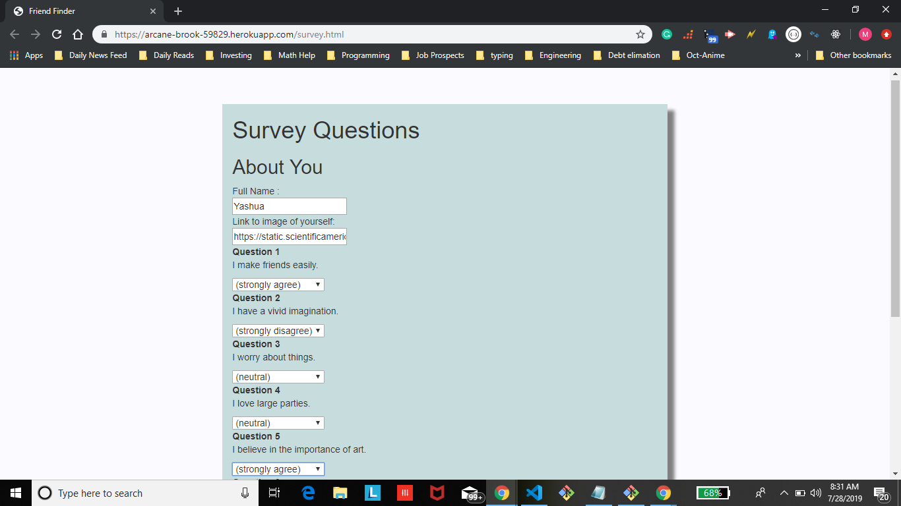

# FriendFinder
Are you looking for some new friends? This is the place for you then. Checkout this  survey and find your new best friend.
## Demo
Demo of app: [Friend-finder](https://arcane-brook-59829.herokuapp.com/)



## Built With
* Node.js

### Prerequisites
Things you need to install the software and how to install them

```
Node.js
```
### Installing
To run the application locally, first clone this repository with the following command.
```
git clone https://github.com/YashuaB/FriendFinder
```
Next, install the application dependencies.

```
cd FriendFinder
npm install
```


Now, open the local application on port 3000 at the URL: http://localhost:8080/.

Congrats! The app is now ready to use!

How to Use:

Survey
Select a response for each question based on if you strongly disagree to strongly agree.
Friend finder compares each question response to all database friends' responses.
Once the survey is complete, Friend Finder will display the friend(s) with the closest responses to your friend.
